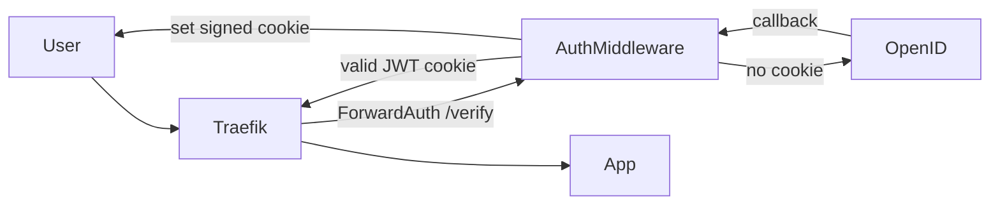

# Architecture Review

## Project Purpose

`AuthMiddleware` is an authentication gateway for reverse proxies. Its main job is to answer Traefik ForwardAuth requests and centralize browser login through an OpenID Connect provider.

In practice it protects upstream services without forcing each service to implement OAuth2 or manage browser sessions on its own.

## Request Flow

## Internal Structure

### `Source/Apps`

Bootstraps the Fastify server and starts listening.

### `Source/Config`

Reads env vars and optional JSON config, validates them with Zod, and derives runtime config such as `isDevelopment`.

### `Source/Plugins`

Encapsulates cross-cutting infrastructure:

- cookies;
- JWT verification and signing;
- OAuth state cookie handling;
- Zod type provider integration;
- OAuth2/OpenID provider registration;
- response `server` header.

### `Source/Routes`

Contains three HTTP endpoints:

- `/health` for liveness;
- `/verify` for the ForwardAuth decision and login redirect;
- `REDIRECT_URI` for the direct OpenID Connect callback.

### `Source/Lib`

Centralized Pino logger.

## Architectural Strengths

- Very small bounded context: the service does one thing and does it at the edge.
- No database dependency in the request path.
- Clear plugin-based composition through Fastify.
- Proxy-friendly design based on `x-forwarded-*` headers.
- Reasonable runtime validation through Zod.

## Architectural Weaknesses

- The service trusts forwarded headers and therefore depends on correct proxy configuration.
- There are no automated tests yet for the login/callback path.
- The identity contract is minimal: `x-user` and `x-user-username` are forwarded.
- Session and JWT policy are hard-coded instead of being fully configurable.
- The service currently focuses on a single provider flow and a browser-based redirect model.

## Problems Found In The Original Version

- The service depended on private monorepo packages, so it could not be published independently.
- `verify.ts` referenced `oneMonth` without importing it, which broke typechecking.
- OAuth user info was treated as an untyped object.
- The callback route mixed too many responsibilities inside one handler.
- The Docker build only worked through the monorepo root and Turbo.
- Tracked `.env` files contained real-looking secrets, which blocked safe publication.
- `keycloak-setup.sh` ignored some environment variables and was partially hard-coded.

## Refactoring Summary

- Moved shared config logic into local files.
- Added a local Fastify type alias instead of importing it from another package.
- Extracted OAuth2 setup into `Source/Plugins/oauth2.ts`.
- Split the browser callback into its own route instead of handling it inside `/verify`.
- Simplified server startup and improved startup logging.
- Converted Docker and Compose files to standalone operation.
- Added CI and Docker publishing workflows for GitHub.
- Added sanitized environment templates and standalone docs.

## Recommended Next Steps

- Add integration tests for `/verify` and callback handling.
- Add support for forwarding richer user metadata such as email or groups if needed.
- Make token TTL and cookie policy configurable through env vars.
- Add explicit proxy trust configuration and stricter header validation.
